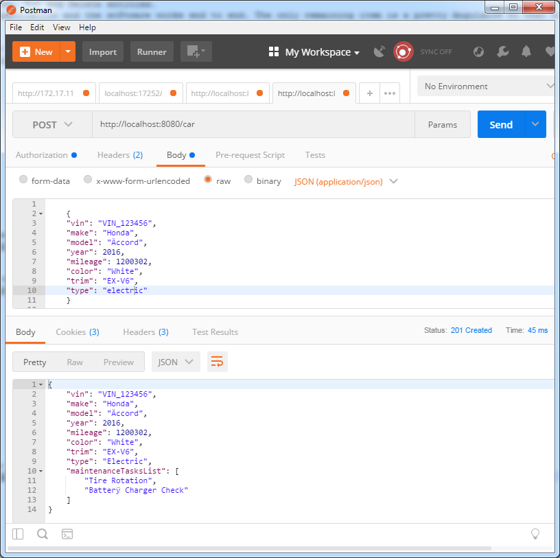
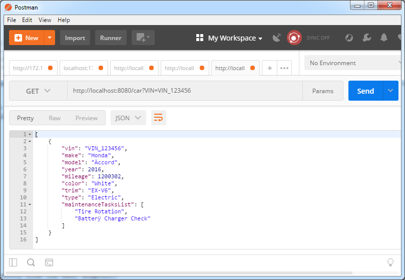
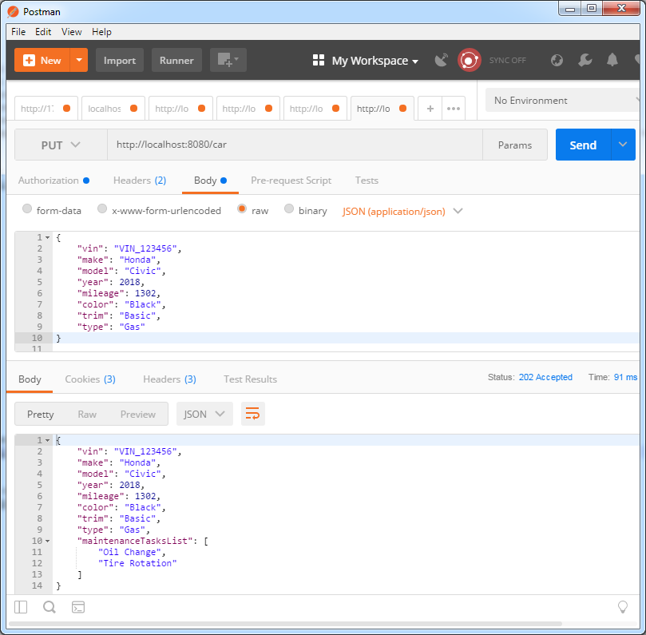
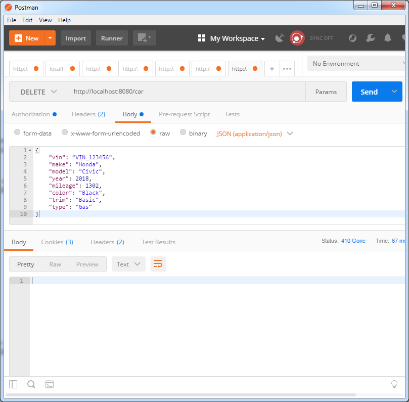

# Automobile Maintenance Tracker

## Pre-install

1. install jdk8
    - set `JAVA_HOME` environment variable
1. install MAVEN
    	
1. install MongoDB
    - [Install MongoDB Community Edition](https://docs.mongodb.com/manual/tutorial/install-mongodb-on-red-hat/)
	
	
## Install

	$ git clone https://github.com/a-hosseini/Automobile-Maintenance-Tracker.git
	

## Run Test Cases
	$ mvn test


## Build & Run

1. Tomcat is the embedded web server in this application.
1. Open the project in an IDE like NetBeans. 
1. Update src/main/resources/application.yml to connect to your MongoDB
1. Build and run the project from the IDE.
1. Use Postman to Get, Post, Put and Delete entities.
1. This is a full stack application and the software works end to end. The only remaining item is a pretty AngularJS UI that will be finished soon.


### Insert: How to Post a new entity into the ReST endpoint:
  -	http://localhost:8080/car
```json

{
    "vin": "ABC",
    "make": "Honda",
    "model": "Accord",
    "year": 2010,
    "mileage": 100000,
    "color": "Red",
    "trim": "Ex-V6",
	type: "Electric"
}

```




### Find: How to Get an entity from the ReST endpoint:
  - http://localhost:8080/car?VIN={ABC}



### Update: How to Put a new entity into the ReST endpoint:
	- http://localhost:8080/car
```json

{
    "vin": "ABC",
    "make": "Honda",
    "model": "Accord",
    "year": 2010,
    "mileage": 100000,
    "color": "Blue",
    "trim": "Ex-V4",
	type: "Diesel"
}

```




### Delete: How to Delete a new entity into the ReST endpoint:
	- http://localhost:8080/car
```json

{
    "vin": "ABC",
    "make": "Honda",
    "model": "Accord",
    "year": 2010,
    "mileage": 100000,
    "color": "Blue",
    "trim": "Ex-V4",
	type: "Diesel"
}

```
